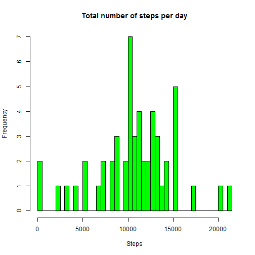
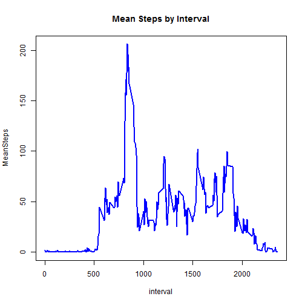
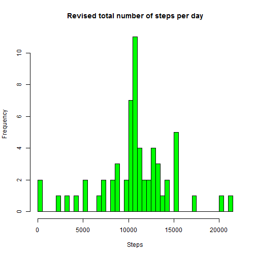
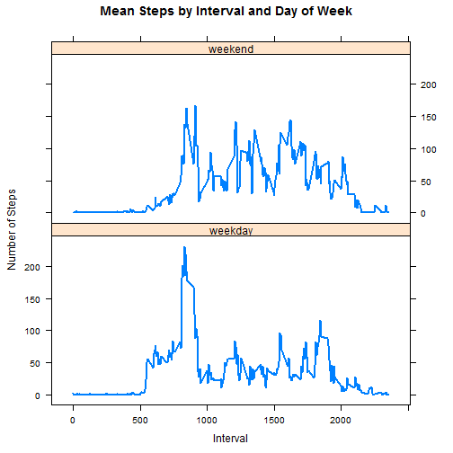

# Reproducible Research
## Assignment 1: Monitoring Activities

In this assignment, the objective is to perform a series of analysis on Activity Monitoring data.


### Loading and preprocessing the data

```r
unzip("activity.zip")
activity2 <- read.csv("activity.csv")
good <- !is.na(activity2$steps)
activity <- activity2[good, ]
```


### What is the mean total number of steps taken per day?
1. Calculate the total number of steps taken per day.

```r
steps <- group_by(activity, date) %>%
        summarize(steps = sum(steps))
```

2. Plot a histogram of the total steps per day.

```r
hist(steps$steps, breaks = 50, col = "green", 
     xlab = "Steps", main = "Total number of steps per day")
```



3. Calculate and report the mean and median of the total number number of steps taken per day.

```r
summary(steps$steps)
```

```
##    Min. 1st Qu.  Median    Mean 3rd Qu.    Max. 
##      41    8841   10760   10770   13290   21190
```

### What is the average daily activity pattern?
1. Time series plot of average number of steps taken across all days by interval

```r
stepsInterval <- group_by(activity, interval) %>%
        summarize(MeanSteps = mean(steps))
with(stepsInterval, plot(interval, MeanSteps, type = "l", lwd = 2, col = "blue", 
                 main = "Mean Steps by Interval"))
```



2. Which 5-minute interval contains the maximum number of steps?

```r
filter(stepsInterval, MeanSteps == max(MeanSteps))
```

```
## Source: local data frame [1 x 2]
## 
##   interval MeanSteps
##      (int)     (dbl)
## 1      835  206.1698
```

### Imputing missing values
1. Calculate the total number of missing values

```r
na <- is.na(activity2$steps)
sum(na)
```

```
## [1] 2304
```

2. Devise a strategy to fill in all missing values in the dataset
The strategy is to simply use the mean steps by interval dataset from the last exercise to fill in the missing values.

3. New dataset, equal to the original dataset, with missing data filled in

```r
newActivity <- merge(activity2, stepsInterval, by.x = "interval", by.y = "interval")
newActivity2 <- mutate(newActivity, newSteps = ifelse(is.na(steps), MeanSteps, steps)) %>%
        select(newSteps, date, interval) %>%
        arrange(date, interval) %>%
        rename(steps = newSteps)
head(newActivity2)
```

```
##       steps       date interval
## 1 1.7169811 2012-10-01        0
## 2 0.3396226 2012-10-01        5
## 3 0.1320755 2012-10-01       10
## 4 0.1509434 2012-10-01       15
## 5 0.0754717 2012-10-01       20
## 6 2.0943396 2012-10-01       25
```

4. Histogram of the total number of steps taken each day and calculate and report the mean and median total number of steps taken per day. Do these values differ from the estimates from the first part of the assignment? What is the impact of imputing missing data on the estimates of the total daily number of steps?

```r
newSteps <- group_by(newActivity2, date) %>%
        summarize(steps = sum(steps))
hist(newSteps$steps, breaks = 50, col = "green", 
     xlab = "Steps", main = "Revised total number of steps per day")
```



```r
summary(newSteps$steps)
```

```
##    Min. 1st Qu.  Median    Mean 3rd Qu.    Max. 
##      41    9819   10770   10770   12810   21190
```
The mean appearantly stayed the same, while the median jumped up by 10.

### Are there differences in activity patterns between weekdays and weekends?
1. Create a new factor variable in the dataset with two levels = "weekday" and "weekend".

```r
activityWeek <- mutate(newActivity2, 
                       DayOfWeek = ifelse(weekdays(as.Date(date)) 
                                %in% c("Saturday", "Sunday"), "weekend", "weekday"))
```

2. Make a panel plot containing a time series plot of the 5-minute interval and the average number of steps taken, averaged across all weekday or weekend days.

```r
library(lattice)
activityWeekInterval <- group_by(activityWeek, DayOfWeek, interval) %>%
        summarize(MeanSteps = mean(steps))
xyplot(MeanSteps ~ interval | DayOfWeek, data = activityWeekInterval, 
       type = "l", layout = c(1, 2), lwd = 2, 
       xlab = "Interval", ylab = "Number of Steps",
       main = "Mean Steps by Interval and Day of Week")
```


